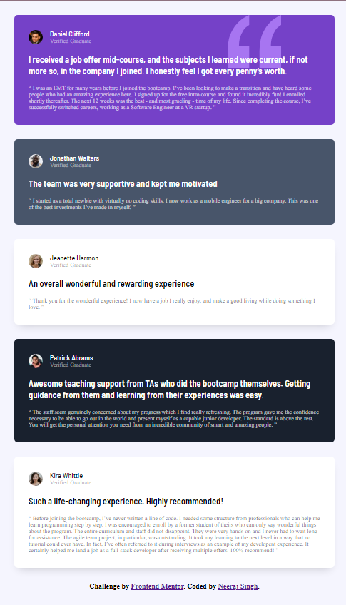
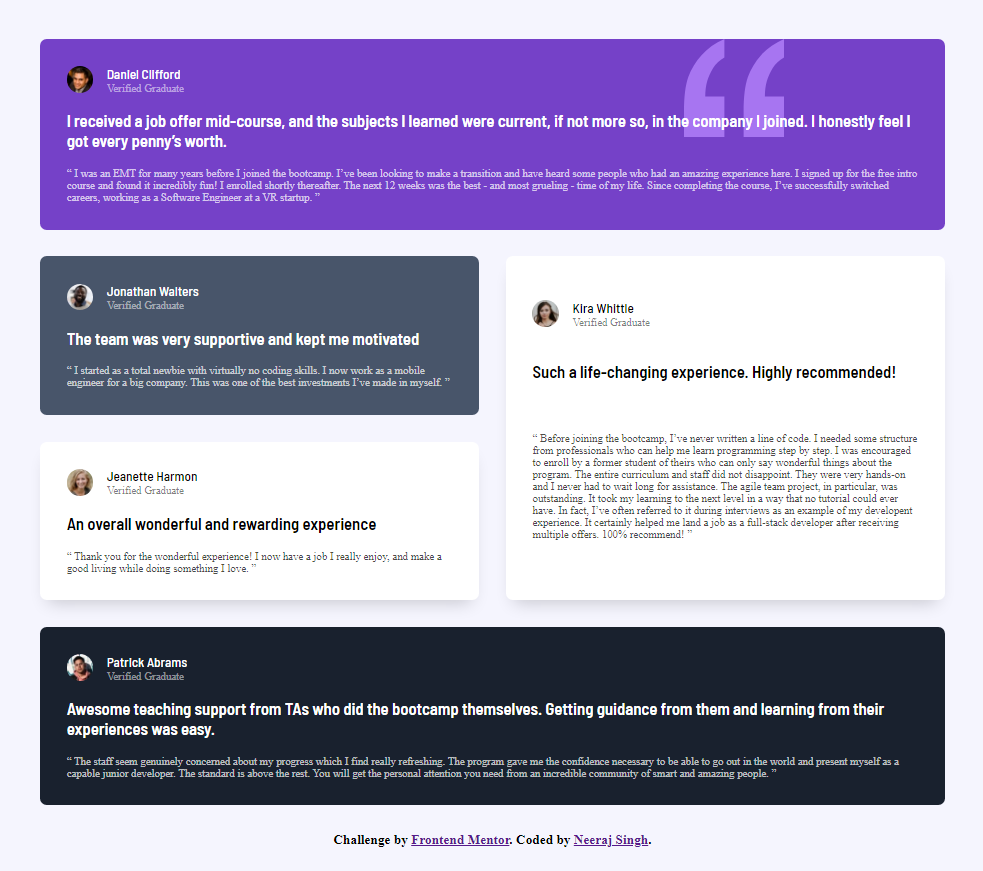
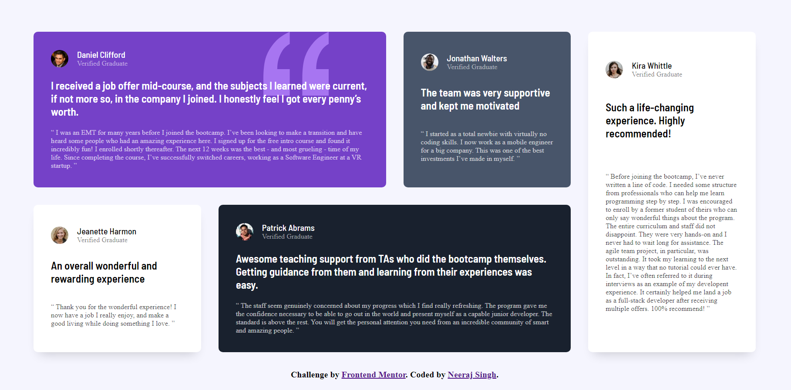

# Frontend Mentor - Testimonials grid section solution

This is a solution to the [Testimonials grid section challenge on Frontend Mentor](https://www.frontendmentor.io/challenges/testimonials-grid-section-Nnw6J7Un7). Frontend Mentor challenges help you improve your coding skills by building realistic projects. 

## Table of contents

- [Overview](#overview)
  - [The challenge](#the-challenge)
  - [Screenshot](#screenshot)
  - [Links](#links)
- [My process](#my-process)
  - [Built with](#built-with)
  - [What I learned](#what-i-learned)
- [Author](#author)

## Overview

### The challenge

Users should be able to:

- View the optimal layout for the site depending on their device's screen size

### Screenshot

- Screenshot in Mobile

- Screenshot in Tablet

- Screenshot in Desktop

### Links

- [Live Site URL](https://testimonials-grid-section869.netlify.app/)

## My process

### Built with

- Semantic HTML5 markup
- Flexbox
- CSS Grid
- Mobile-first workflow

### What I learned

I learnt how to use grids in project and how to write a good README.md file.

I used Markdown guide to learn how can I wirte README.md file. Here is the link if you are interested in learning about [Markdown]((https://www.markdownguide.org/))

## Author

- Frontend Mentor - [@neerajsingh869](https://www.frontendmentor.io/profile/neerajsingh869)
- Twitter - [@neeraj_techwhiz](https://twitter.com/neeraj_techwhiz)